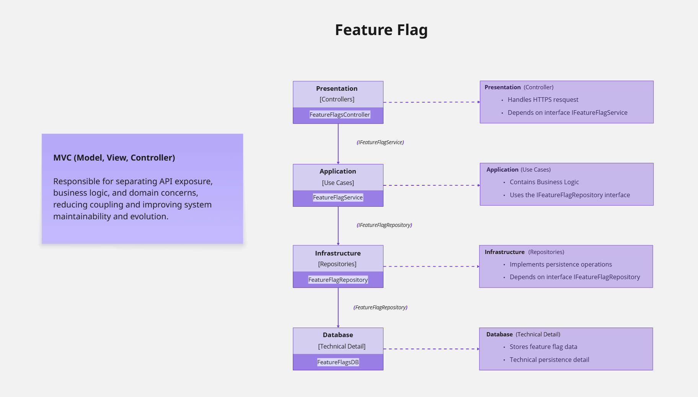

# Feature Flag System (Backend)

This repository contains the **backend** of a simple **Feature Flag system with percentage-based rollout**, created for study and backend architecture practice.

The goal of this project is to demonstrate how feature flags can be managed centrally and released gradually **without requiring new deployments**.

---

## About the project

Instead of using only ON/OFF feature flags, this system supports a **rollout percentage (0 to 100)**.

This strategy is widely used in real-world applications to:
- reduce risk during releases
- test features with a subset of users
- gradually enable functionality

All decision logic lives in the backend and is exposed through a REST API.

---

## How it works

Each feature has a configurable rollout percentage:

- `0%` → feature disabled
- `100%` → feature fully enabled
- intermediate values → feature enabled for a portion of users

The backend is responsible for:
- calculating feature availability
- ensuring consistent behavior
- centralizing feature control

---

## Architecture

The backend is structured using **Clean Architecture principles**, focusing on clear separation of concerns and long-term maintainability.

The project is divided into the following layers:

- **Api**  
  Responsible for handling HTTP requests, exposing REST endpoints, and configuring the application.  
  This layer depends only on the Application layer.

- **Application**  
  Contains the core business logic and use cases of the system.  
  It defines how feature flags are evaluated and orchestrates interactions between layers.

- **Domain**  
  Holds the core entities and business rules.  
  This layer is independent and does not rely on any external frameworks or infrastructure.

- **Infrastructure**  
  Provides implementations for data access and external services.  
  It contains repositories and persistence-related logic.

This architecture improves **maintainability**, **testability**, and **scalability**, while keeping the system flexible for future changes.

---

## Admin features

The system includes an admin-focused API that allows:

- Updating feature rollout percentages
- Persisting configuration changes
- Immediately affecting application behavior

Access to these operations is restricted to authorized users.

---

## Tech stack

- ASP.NET Core
- C#
- Entity Framework Core
- RESTful API

---

## Project scope

This is an **educational project**, intentionally kept simple.

- No advanced authentication flows
- No environment-specific configuration files documented
- Focus on backend logic and architecture clarity

The frontend for this project is available in a separate repository:  
- https://github.com/MarcossSantoss/feature-flag-ui

---